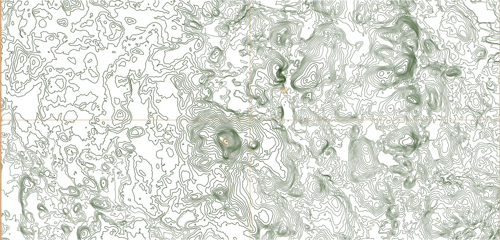
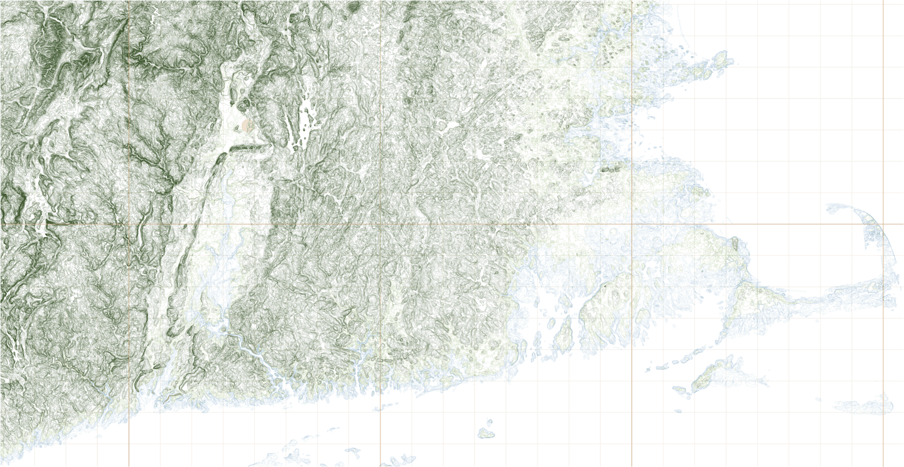
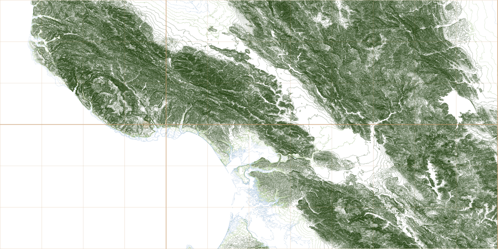
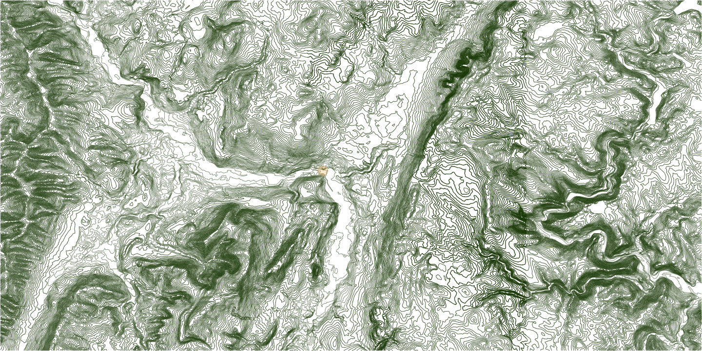

# Contour Map

Create SVG files for contour maps from USGS shapefile data.

The somewhat standard `node_modules/.cache` directory is where fetched shapefiles are stored. Note first time a shapefile is downloaded it is much slower than when cached there after.

```
npm exec -- @solenoid/contour-map -v
```

For local development you can use `node` or call `index.js` directly.

```
node --no-warnings index.js -v
./index.js -v
```

## Example Maps

If you wanted a contour map of Wachusett Mountain (skiing) and Crow Hill (climbing) areas try the following.

- [Mount Wachusett Summit at -71.7875,42.688889](https://en.wikipedia.org/wiki/Mount_Wachusett)
- [Crow Hill Rock Climbing at -71.858,42.515](https://www.mountainproject.com/area/105905492/crow-hill)

```shell
# general usage
npm exec -- @solenoid/contour-map \
--shapes=ELEV_Boston_W_MA_1X1_Shape \
--bbox=-72,42.44,-71.75,42.56 \
--dots=-71.8875,42.488889,-71.858,42.515 \
--simplify=50%

# running locally
./index.js \
--shapes=ELEV_Boston_W_MA_1X1_Shape \
--bbox=-72,42.44,-71.75,42.56 \
--dots=-71.8875,42.488889,-71.858,42.515 \
--simplify=50%
```



```shell
# All of Massachusetts and States South with a dot on UMASS Amherst.
./index.js \
--shapes=ELEV_Boston_W_MA_1X1_Shape \
--shapes=ELEV_Albany_E_MA_1X1_Shape \
--shapes=ELEV_Boston_E_MA_1X1_Shape \
--shapes=ELEV_Providence_C_MA_1X1_Shape \
--shapes=ELEV_Providence_E_MA_1X1_Shape \
--shapes=ELEV_Providence_W_RI_1X1_Shape \
--shapes=ELEV_Hartford_E_CT_1X1_Shape \
--shapes=ELEV_Hartford_W_CT_1X1_Shape \
--shapes=ELEV_Albany_W_NY_1X1_Shape \
--bbox=-73.51,41.035,-69.92,42.89 \
--simplify=2% \
--dots=-72.526390,42.391501
```



```shell
# UC Santa Cruz
./index.js \
--shapes=ELEV_San_Francisco_E_CA_1X1_Shape \
--shapes=ELEV_Santa_Cruz_E_CA_1X1_Shape \
--shapes=ELEV_San_Jose_W_CA_1X1_Shape \
--shapes=ELEV_Monterey_W_CA_1X1_Shape \
--bbox=-122.25,36.875,-121.75,37.125 \
--keep10=0,0 \
--keep20=0,160 \
--keep40=160,21000 \
--simplify=30% \
--no-grid \
--dots=-122.06,37

# UC Santa Cruz, zoomed out, without grid lines
./index.js \
--shapes=ELEV_San_Francisco_E_CA_1X1_Shape \
--shapes=ELEV_Santa_Cruz_E_CA_1X1_Shape \
--shapes=ELEV_San_Jose_W_CA_1X1_Shape \
--shapes=ELEV_Monterey_W_CA_1X1_Shape \
--bbox=-123,36.625,-121,37.375 \
--keep10=0,0 \
--keep20=0,160 \
--keep40=160,21000 \
--simplify=5% \
--no-grid \
--dots=-122.06,37

# UC Santa Cruz, zoomed out, with grid lines
./index.js \
--shapes=ELEV_San_Francisco_E_CA_1X1_Shape \
--shapes=ELEV_Santa_Cruz_E_CA_1X1_Shape \
--shapes=ELEV_San_Jose_W_CA_1X1_Shape \
--shapes=ELEV_Monterey_W_CA_1X1_Shape \
--bbox=-122.5,36.625,-121,37.375 \
--keep10=0,0 \
--keep20=0,160 \
--keep40=160,21000 \
--simplify=10% \
--dots=-122.06,37
```



```shell
# Minute Man Visitor Center
./index.js \
--shapes=ELEV_Boston_W_MA_1X1_Shape \
--bbox=-71.351,42.43,-71.251,42.48 \
--dots=-71.269489,42.448579 \
--simplify=75%

# North Adams Massachusetts, The Porches Inn
./index.js \
--shapes=ELEV_Albany_E_MA_1X1_Shape \
--shapes=ELEV_Albany_W_NY_1X1_Shape \
--bbox=-73.3,42.6,-72.9,42.8 \
--simplify=10% \
--no-grid \
--dots=-73.116040,42.702719
```



## Resources

To understand the data that makes these contour maps see:

https://pubs.usgs.gov/sir/2012/5167/sir2012-5167.pdf
